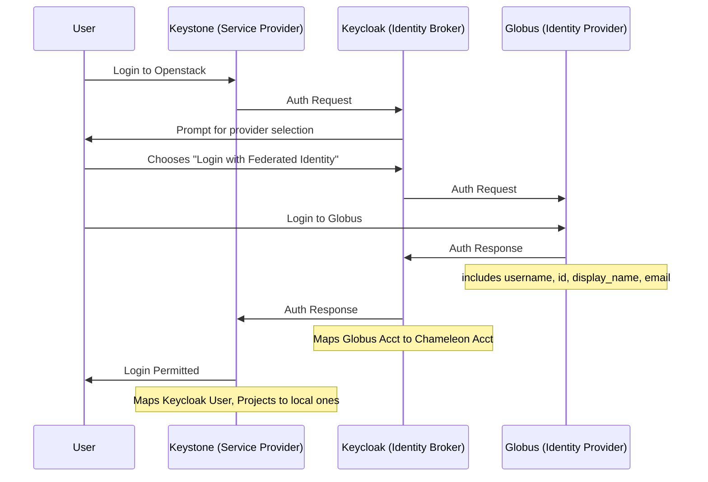

# How Chameleon's Identity Federation Works

Chameleon uses Keycloak as the respository of chameleon-wide user accounts. However, we deletate authentication to Globus and/or TAS.

Additionally, on login to an openstack site, keycloak sends a token to keystone which contains the username and list of project memberships, which keystone maps into local ones.

Note: Globus itself is also an identity broker, and this process can be continued as far as desired.

Google, and ORCID logins are special casses of the globus login, and merely pre-fills a selection on the "login to globus" step. In contrast, "Log in with TAS" uses a Keycloak server at TACC as Identity Provider, instead of Globus.

Due to this delegation, keycloak need not hold any "password" for a user, since they only ever log in via an external identity source.

The chameleon portal is the mechanism by which projects are created and managed in keycloak, and in particular, we set a flag to indicate whether a given project has an active allocation.

Keycloak holds a unique "client" for each service provider, which includes portal, keystone at each site, and several other services which leverage SSO (Jupyterhub, grafana,...).

We have added a custom "mapper" to Keycloak such that when one of these clients sends an auth request, keycloak responds with a list of projects that the user is a member of, *filtered for only ones with an active allocation*.

Keystone, when it receives a token with this list of projects, is configured to create a local project and user membership therein, updated at the time of login.

*Note: if they never log in again, this means that users will remain in expired local projects indefinitely.*

## Issues with Account Linking

On first login, keycloak attempts to match the incoming identity from Globus or TAS with an existing Chameleon account, and does so by comparing the "primary id" from the provider, to the "linked identities" of the Chameleon accounts.

In the simple case, this all works well, and either a match is found, and the user logged in, or a match is not found, and a new account created.

However, we ran into issues where users would end up with N different globus accounts, and a unique chameleon account for each, and therefore would not have consistent project memebership or openstack resource ownership, depending on the federated identity used.

To address this, we added a check not just for the primary ID, but also the linked email address. In the case where an the primary ID does *not* match, but an email address does, the user is asked to separately authenticate to the matched identity to prove ownership, after which the linked identity is updated to the new one.

This works for TAS, but encounters multiple issues with Globus. 

1. The account linking mechanism for globus is prompting for the "password" of the other keycloak account, which may not have ever been set.
2. In globus, it is valid to have multiple different accounts with the same email address associated. 
    1. Additionally, Globus accounts can either be completely independent, in which case they return unique primary identities to keycloak
    1. or they can be "linked", in which case globus will return a single primary identity for all of them, but also include a list of linked identities.
3. A user may not be aware of what globus identity they are authenticated.
4. the identity we map from keycloak -> Keystone is the globus "username", but this is not a guaranteed stable identifier, and may change over time.

Ultimately, we should implement some or all of the following:

1. Display a users currently authenticated federated identity on the account linking screen
2. provide a mechanism to open a helpdesk ticket from the account linking page
3. permit use of email to validate linked accounts (but only verified emails)
4. take advantage of the list of identities that globus returns to match users more robustly, and direct users to the globus account linking

## References

* [Globus Identities](https://docs.globus.org/api/auth/specification/#identities)
* [OpenID Auth Code Flow](https://openid.net/specs/openid-connect-core-1_0.html#CodeFlowAuth)
* [Keycloak ID Brokering](https://www.keycloak.org/docs/latest/server_admin/index.html#_identity_broker_overview)
* [Migrating towards Single Sign-On and Federated Identity](https://chameleoncloud.org/media/filer_public/8e/a5/8ea5bbb8-5b21-4ee7-a29c-3063afef7751/pearc22-federated-identity.pdf)
